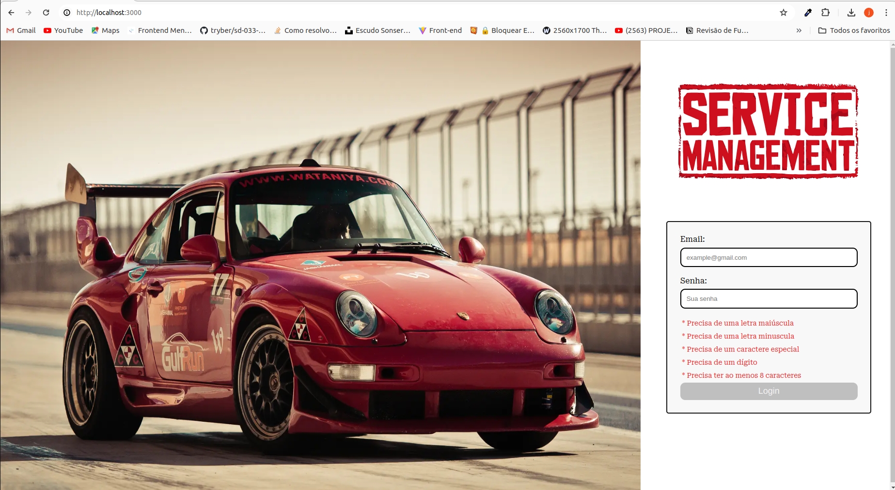
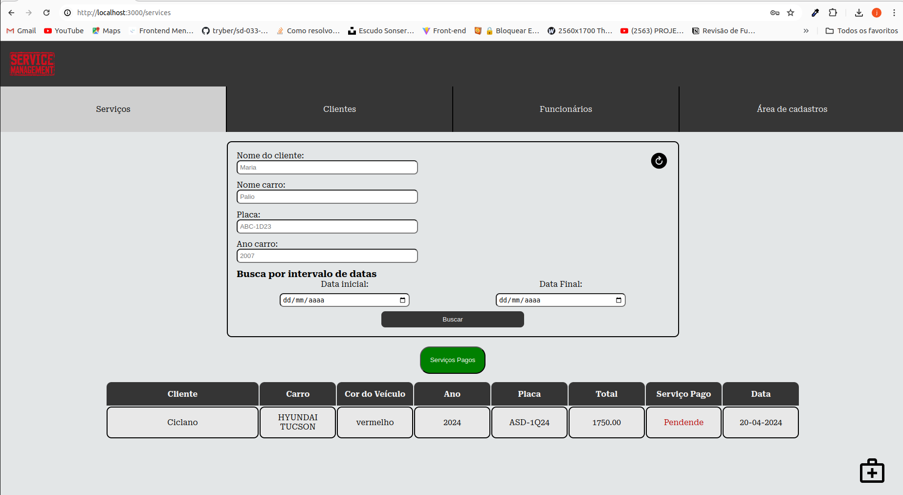
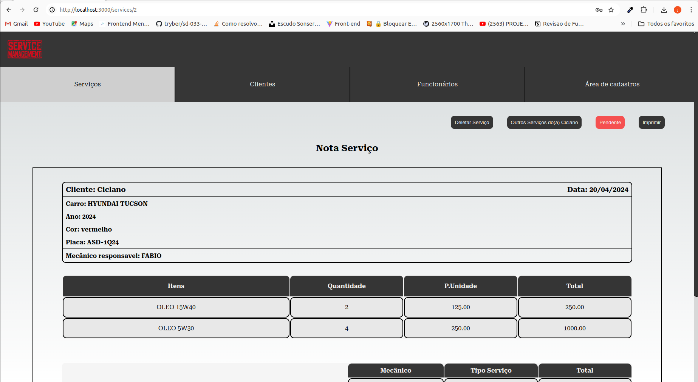
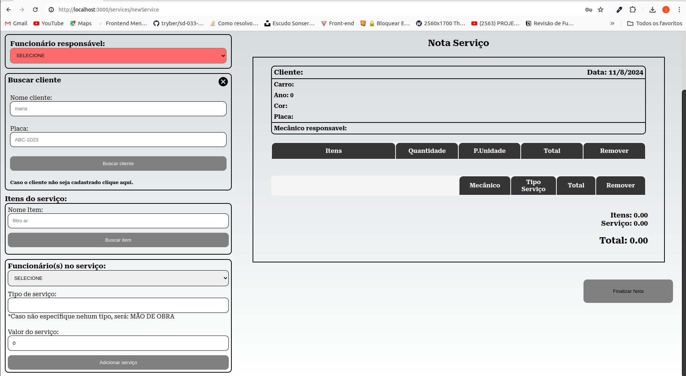
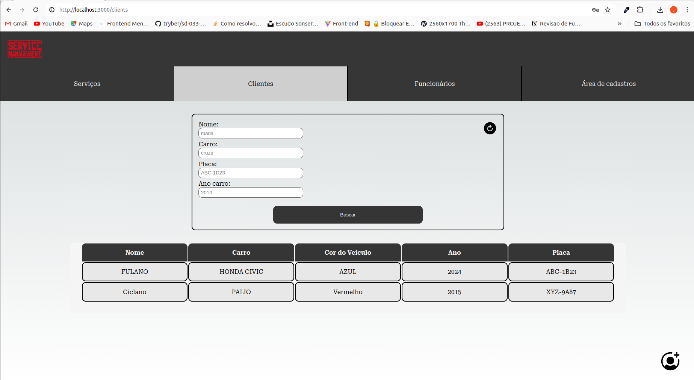
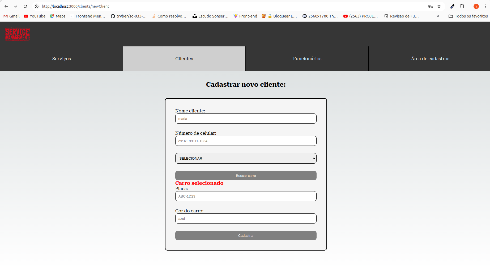
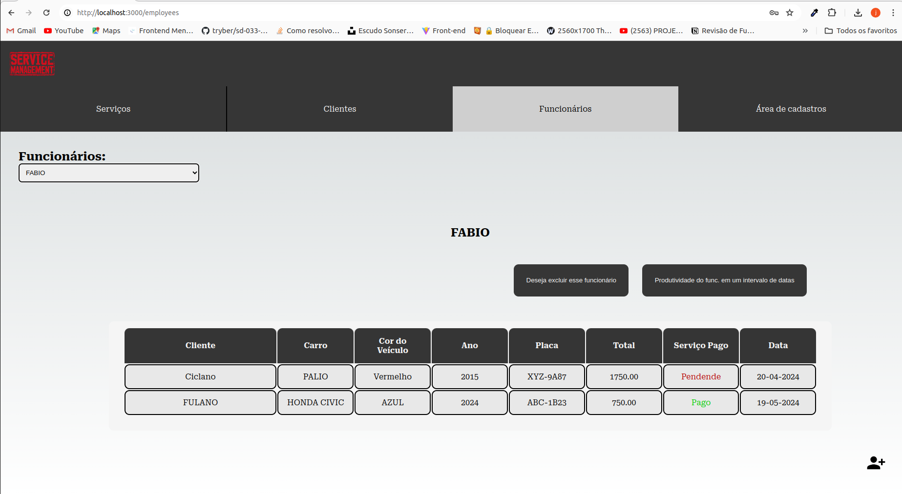
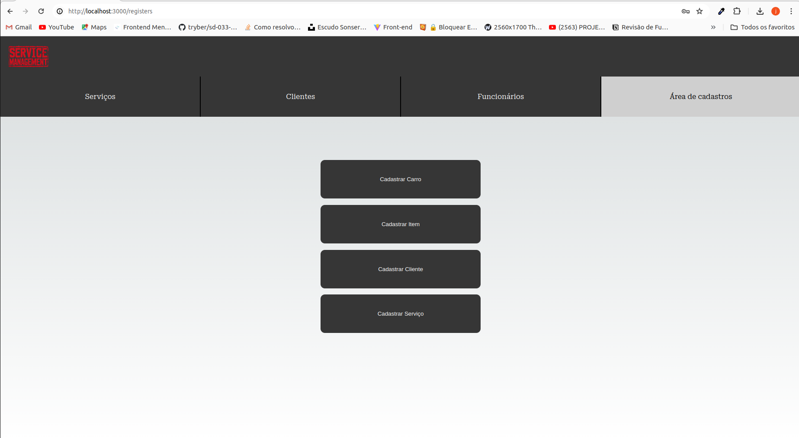

<h1 align="center">Service Management</h1>

<h4>Glossário</h4>

- O que é esse projeto? E o que é possivel fazer?
- Tecnologias Utilizadas
- Como rodar o projeto no seu computador?
- Como rodar os testes?
- App em Funcionamento

## O que é esse projeto? E o que é possivel fazer?

**O Service Management tem como objetivo fazer o gerenciamento dos serviços de uma oficina mecânica de automóveis.**

#### Com esta aplicação é possivel:

<details>

#### Notas de Serviços:
- Criar notas do serviço.
- Visualizar detalhes da nota.
- Deletar notas.
- Atualizar status de pagamento da nota.

#### Clientes:
- Cadastrar cliente.
- Deletar cliente.
- Atualizar dados do cliente.

#### Funcionários:
- Cadastrar funcionário.
- Deletar funcionário.
- Visualizar serviços do funcionário.
- Visualizar performace do funcionário em um intervalo de datas.

#### Itens e Carros:
- Cadastrar itens.
- Cadastrar carros.

</details>

## Tecnologias Utilizadas

<div align="center">


</div>

## Como rodar este projeto no seu computador?

Para rodar este projeto localmente, é necessário atender alguns requisitos.

<details>
    <summary><b>Pré-requisitos:</b></summary>

- Ter no mínimo 10GB livres no seu sistema.
- Ter o Git instalado em seu terminal. **[link](https://github.com/git-guides/install-git)**
- Ter uma chave SSH atrelada à sua conta no GitHub. [**link**](https://docs.github.com/en/authentication/connecting-to-github-with-ssh)

</details>


**Para rodar o projeto localmente, siga estes passos:**

OBS: Para utilizar esse projeto localmente da melhor maneira faça o clone também do `back-end` deste projeto: [Service Manager API](https://github.com/joseVitor03/Service-Management-API) 

Clone o projeto

```bash
# Com SSH
$ git clone git@github.com:joseVitor03/Service-Management-Front-End.git

# Com HTTP
$ git clone https://github.com/joseVitor03/Service-Management-Front-End.git
```

Para rodar o projeto, instale as dependências primeiro:

```bash
$ npm install
```
```bash
npm run dev
```
## Como rodar os testes?

Para rodar os testes é preciso antes rodar o comando para levantar a API de testes:
```bash
npm run api
```

Agora pode rodar os testes:
```bash
npm run cypress
```

## App em Funcionamento:

#### 📍Rotas do App:

| rotas    |  descrição       
|-----------|----------------------
| /         | página de `login` [response-details](#login)
| /services  | página onde lista os serviços tanto pendentes quanto pagos. [response-details](#services)
| /services/:id  | página onde mostra os detalhes do serviço. [response-details](#service-details)
| /service/newService  | página para cadastrar um novo serviço. [response-details](#new-service)
| /clients          | página onde lista os clientes. [response-details](#clients)
| /clients/:id       | página para ver os dados e os serviços realizados do cliente. [response-details](#client-details)
| /clients/newClient   | página para cadastrar um novo cliente. [response-details](#new-client)
| /employees    | página das informações dos funcionários. [response-details](#employees)
| /registers    | página para realizar cadastros ou redirecionar o usúario para isso. [response-details](#registers)

<details>

<h3 id="#login">Página de login</h3>

<div align="center">
    
</div>

<h3 id="#login">Página de serviços</h3>

<div align="center">
    
</div>

<h3 id="#login">Página de detalhes do serviço</h3>

<div align="center">
    
</div>

<h3 id="#login">Página de novo serviço</h3>

<div align="center">
    
</div>

<h3 id="#login">Página de clientes</h3>

<div align="center">
    
</div>

<h3 id="#login">Página de detalhes do cliente</h3>

<div align="center">
    
</div>

<h3 id="#login">Página de novo cliente</h3>

<div align="center">
    
</div>

<h3 id="#login">Página de funcionários</h3>

<div align="center">
    
</div>

<h3 id="#login">Página de registros</h3>

<div align="center">
    
</div>

</details>